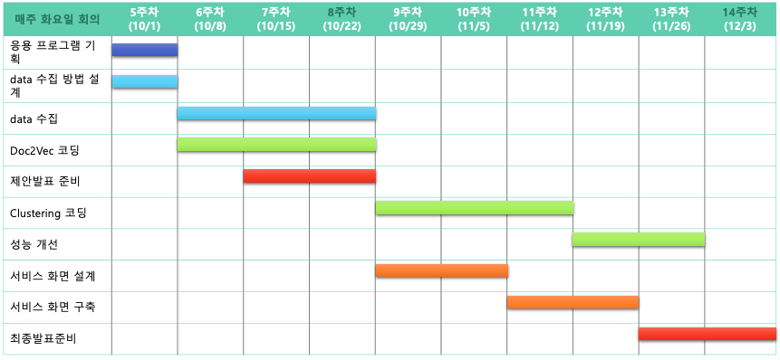
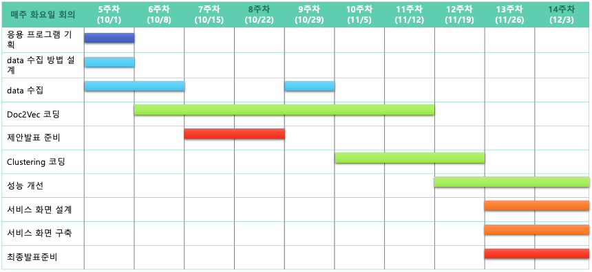
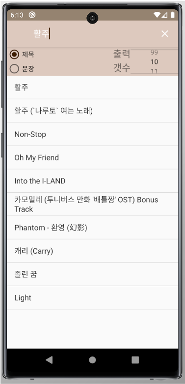

# 다양한 플레이 리스트 생성기
# 팀: September

- 팀원: 이재욱(게임학과), 정창현(컴퓨터과학과), 신창호(컴퓨터과학과), 최보원(게임학과)

---
## 주제
- 다양한 플레이 리스트 생성기

  - nlp를 활용하여 제목 또는 가사를 입력하였을때, 노래를 추천해준다. 
---

##  기술 개발 전략

- Doc2Vec 을 이용한 가사 벡터화
- 벡터 군집화
- PC 프로그램 및 안드로이드 어플리케이션 개발

---

## 일정 계획

- 기획 - 데이터 수집 - 전처리 - 모델 - 서버,클라이언트 구성 - 발표준비

---
---
### 진행 상황

#### 10/01 ~ 10/07
- 주제 선정  및 기획

#### 10/08 ~ 10/14
- 데이터 수집

#### 10/15 ~ 11/18
- 모델 구성(Doc2Vec) 및 클러스터링 

#### 11/19 ~ 12/02
- 모델 성능 개선 및 서버 , 클라이언트 구축

#### 12/03 ~ 12/06
- 최종 발표 준비

---

## 결과

### windows 프로그램

### android application

